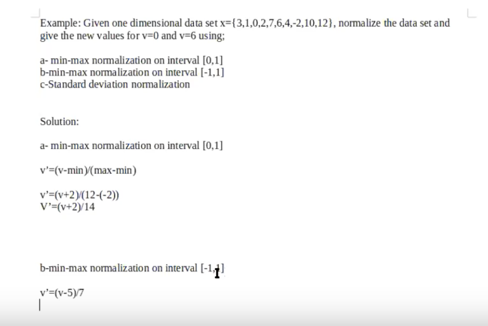
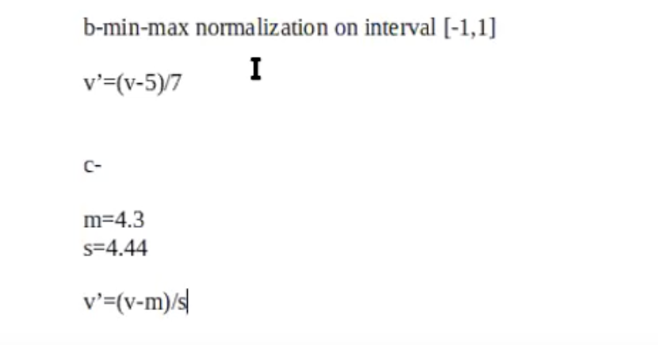

# 2. Week - 9 October 2023 Monday

[Data Mining: Data Preprocessing - 02. Hafta -  DataMining.ppt
](https://avesis.yildiz.edu.tr/resume/downloadfile/svarli?key=37aed94b-8fcd-4961-b7b8-3ddb2d3c1551&announcementId=76b91c97-1a38-4260-9525-757ff5e64004) dosyası üzerinden dersi işliyoruz.

# Preparing the Data

* Raw Data: Düzenlenmemiş, içerisinde gereksiz bilgiler olan veridir.
* Nümerik öznitelikler üzerinden normalizasyon işlemleri yapılır.
* Outlier Detection: Eğer sınırın çok dışında değerler varsa bunların kaldırılması lazım.

|          | Feature 1 | Feature 2 | Feature 3 | Feature 4 |
|----------|-----------|-----------|-----------|-----------|
| Sample 1 |           |           |           |           |
| Sample 2 |           |           |           |           |
| Sample 3 |           |           |           |           |

# Transformation of Raw Data

## 1) Data Normalizations

* The measured values can be scaled to a spesific range eg. [-1, 1]
* Three simple and effective ways of normalization of raw data
  * Decimal scaling
  * Min-Max normalization
  * Standard Deviation Normalization

Yaş verisi ve maaş verisi arasında çok büyük farklar olabilir. Bu yüzden normalizasyon yapmak gerekir. 
* Maaşı 100 000 olan için bir distance hesabı yaparken yaş çok küçük (0-100 arası) kaldığı için hesaplanan distance ve verilerin sonuçlara etkisi çok küçük olur.
* Bu durumda veriden anlamlı bir bilgi çıkarmamızı engeller.

### Decimal Scaling

V'(i) = V(i) / 10^k

[455, -834] -> [0.455, -0.834]  
k = 3 olur böylelikle.

### Min - Max Normalization

V'(i) = (V(i) - min(V(i))) / (max(V(i)) - min(V(i)))

### Standard Deviation Normalization (Z-Score Normalization)

V'(i) = (V(i) - mean(v)) / sd(v)

* mean: Ortalama
* sd: Standart Sapma

## Vize Benzeri Soru

TODO: Data Normalization başlığından vize 1 de soru geldi. Şu soruya benzer olduğunu düşünüyorum.
* Çözümü için aşağıdaki online tool lardan yardım alabilirsiniz.

## Online Normalization Tools

[Standard Deviation Calculator](https://www.calculator.net/standard-deviation-calculator.html?numberinputs=3%2C+1%2C+0%2C+2%2C+7%2C+6%2C+4%2C+-2%2C+10%2C+12&ctype=s&x=Calculate)  
Önemli Not: Standart sapma hesaplarken population mı yoksa sample mı olduğuna dikkat etmemiz gerekiyor.
* population için hesabı yapıyorsak n e böleriz
* sample için hesabı yapıyorsak n-1 e bölmemiz gerekiyor.
* Sample lar üzerinden hesap yaptığımız için bizim n-1 e bölmemiz gerekiyor.

[Min-Max & Z-Score Normalization](https://www.koshegio.com/data-normalization)
* x = { 3, 1, 0, 2, 7, 6, 4, -2, 10, 12 }
* Yukarıdaki site n e bölerek hesap yapıyor.
* Normalde hoca n-1 e bölerek hesap yapmamızı istiyor.
* Sınavda n-1 e bölerek yap

## 2) Data Smooting
* Gözle daha kolay anlaşılması için virgülden sonrayı yuvarlamak da basit bir smoothing sayılabilir. (integer smooting)
* Binning
* Regression
* Clustering
* Combined ...

### Simple Discretization (Binning)
* Equal width (distance) partitioning
* Equal depth (frequency) partitioning

## 3) Differences and Ratios
* Body Mass Index (BMI)

# Missing Data
Automatic replacement of missing values
* Replace all missing with a single global constant
* Replace missing with its feature mean
* Replace missing with its feature mean for the given class (only for classification problems)

* Bir sample da eğer çok boş değer varsa, o boş olan sample ı sil.
* Eğer bir feature da çok boş değer varsa, sadece boş olan feature (V) özelliği sil. Fakat bu özelliğin sonucu çok etkileyip etkilemediğinden emin olmam lazım. Silip denenebilir.

# Time Dependent Data

# Outlier Analysis

Kredi kartı sahteciliğinde de kullanılıyor.  
Verinin daha önceki pattern ine uymayanları analiz edebiliyorum.  

## Boxplot Outlier Analysis

Quartiles

* **Quartiles**: Q1 (25th percentile), Q3 (75th percentile)
* **Inter-quartile range**: IQR = Q3 - Q1
* **Five Number Summary**: Min, Q1, M, Q3, max
* **Boxplot**: Ends of the box are quartiles, median is marked, whiskers, and plot outlier individually
* **Outlier**: Usually, a value higher/lower than 1.5 x IQR
  * 1.5 yerine 2 katına göre outlier işaretlemeyi seçebilirim. Duruma göre biz karar veriyoruz.

[Data Mining: Data Preprocessing - 02. Hafta -  DataMining.ppt
](https://avesis.yildiz.edu.tr/resume/downloadfile/svarli?key=37aed94b-8fcd-4961-b7b8-3ddb2d3c1551&announcementId=76b91c97-1a38-4260-9525-757ff5e64004) dosyası 31. slayt ta kaldık.